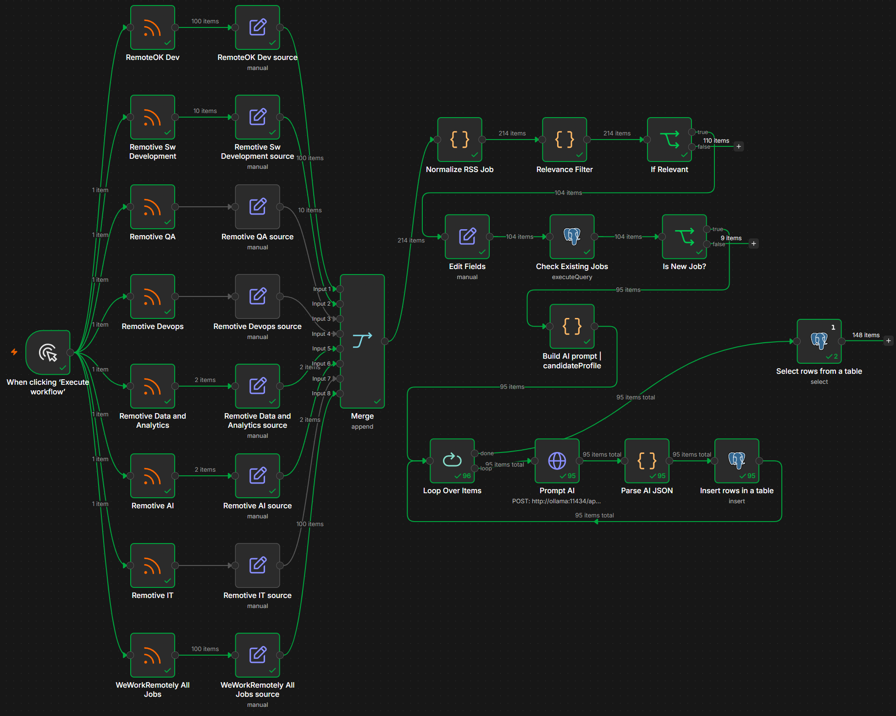

# IT & Automation Home Lab

This is a personal home lab project built to refresh and expand my practical IT skills across system administration, self-hosting, workflow automation, local AI tools and database-backed processes.

The lab currently includes an Ubuntu Server VM running Docker-based services and a Windows Server VM with Active Directory installed. One of the first automation workflows I built is a job search automation prototype using n8n, Ollama/local LLM and PostgreSQL.

## Current Lab Setup

* Ubuntu Server VM
* Docker
* n8n
* Ollama / local LLM
* PostgreSQL
* Windows Server VM
* Active Directory practice environment

## Job Search Automation Workflow

The n8n workflow was built as a practical automation exercise. It processes job posting data, filters relevant roles, checks for duplicates, sends selected jobs to a local LLM for scoring and keyword extraction, parses the AI response as JSON and stores structured results in PostgreSQL.

### Workflow steps

1. Collect job posting data from multiple sources.
2. Normalize and filter the data.
3. Check for duplicate entries in PostgreSQL.
4. Send relevant job postings to a local LLM through Ollama.
5. Parse the AI response as structured JSON.
6. Store the results in PostgreSQL for later review.

## Active Directory Lab

I also started setting up a Windows Server VM with Active Directory to refresh my system administration skills.

Current status:

* Windows Server VM installed
* Active Directory Domain Services installed

Planned next steps:

* Add a Windows client VM
* Join the client to the domain
* Create test users, groups and OUs
* Practice basic Group Policy configuration
* Practice shared folder permissions
* Keep the lab isolated in its own NAT network

## What I practiced

* Ubuntu Server setup
* Docker-based self-hosting
* Workflow automation with n8n
* Local AI experimentation with Ollama
* PostgreSQL storage
* Basic Windows Server / Active Directory administration
* Troubleshooting and iterative setup

## Status

This is a learning-focused home lab, not a production system. The goal is to build practical experience and gradually expand the lab with more realistic IT support, system administration and automation scenarios.
